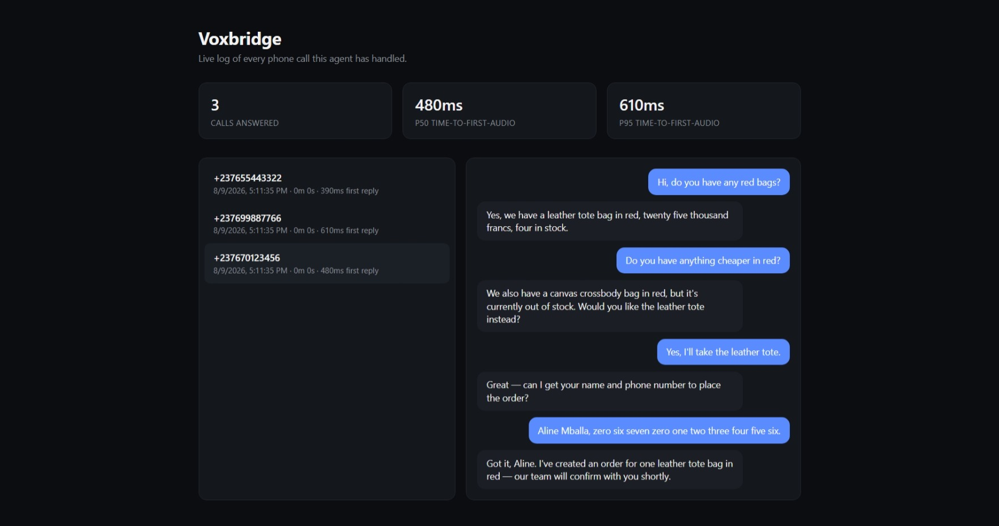

# Voxbridge

A real-time voice agent that answers real phone calls: it transcribes what
the caller says, reasons about it (including looking things up in a product
catalog and taking orders), and speaks a reply back — interruptible
mid-sentence, like an actual conversation. A companion dashboard shows
every call as it happens, since a phone call itself leaves no visual trace.



## Why this exists

Most "AI agent" demos are request/response: send text, wait, get text back.
A phone call is a different engineering problem — audio has to be
transcribed, reasoned about, and spoken back **while the conversation is
still happening**, and a caller who starts talking over the assistant
expects it to shut up immediately, not finish its sentence. This project is
a from-scratch reference implementation of that pipeline, built to be read
and extended rather than just run as a black box.

## What it actually does

```
 caller's phone --carrier's media stream--> WebSocket --> Deepgram (streaming STT)
                                                                 |
                                                      final transcript ready
                                                                 v
                                                        LLM (OpenAI or Anthropic)
                                              streamed token by token, with tools:
                                       search_products / check_stock / start_order / escalate_to_human
                                                                 v
                                       sentence boundary reached --> ElevenLabs (streaming TTS)
                                                                 |
                                                    audio streamed back to the carrier
                                                                 v
                                                          caller hears the reply

Every turn is written to CallLog (SQLite) as it happens --> dashboard reads from there
```

Three things this pipeline is specifically built to demonstrate:

- **Incremental synthesis** — the first sentence of the reply is spoken
  while the LLM is still generating the rest of it (see
  `sentence_chunks()` in `backend/app/providers/llm.py`), instead of
  waiting for the full response before any audio goes out.
- **Barge-in** — Deepgram's `vad_events` tells the server the instant the
  caller starts speaking again. If the assistant is still talking, its
  in-flight LLM/TTS task is cancelled and the carrier is told to clear
  playback immediately (`backend/app/session.py`, `_barge_in()`).
- **Tool-calling depth** — the agent doesn't improvise answers about the
  business. It calls real tools (`backend/app/tools.py`) against a real
  catalog (`backend/app/data/products.json`) and only ever creates
  **draft orders requiring human confirmation** — it can't charge or ship
  anything on its own. Every draft order shows up on the dashboard's
  Orders panel, not just buried in a transcript.

The server also logs a measured **time-to-first-audio** for every turn —
the metric that actually matters for how a voice agent *feels*, not just
whether it eventually answers correctly. The dashboard aggregates it into
p50/p95 across every call.

## Telephony is carrier-agnostic by design

`backend/app/providers/telephony.py` defines a `CallTransport` interface —
answer a call, stream audio in, stream audio out, clear playback for
barge-in. One carrier is implemented against it so far, but nothing in
`session.py` or anywhere else in the app knows or cares which one —
swapping carriers later means adding one more class in that file, not
rewriting the pipeline. Which carrier is active is one line in `.env`
(`TELEPHONY_PROVIDER`), not something hardcoded through the codebase.

**Known gap**: the exact Media Streaming message shape (field/event names)
is implemented to the best of current documented knowledge and should be
re-verified against the carrier's live docs before a first real call —
these details do shift between API versions.

## Running it

Nothing in this repo works without your own API keys and accounts — none
are bundled.

1. `cd backend && pip install -r requirements.txt`
2. `cp ../.env.example .env` and fill in your own keys:
   - [Deepgram](https://console.deepgram.com) for speech-to-text (free trial credit)
   - [ElevenLabs](https://elevenlabs.io) for text-to-speech (free tier available)
   - OpenAI or Anthropic for the LLM (set `LLM_PROVIDER` accordingly)
   - A telephony carrier: buy a number, get an API key, and set
     `TELEPHONY_PUBLIC_URL` to a public https URL this server is reachable
     at (a real deploy, or an `ngrok http 8000` tunnel while testing locally
     — the carrier can't reach `localhost`). Point the carrier's webhook at
     `<TELEPHONY_PUBLIC_URL>/telephony/webhook`.
3. `uvicorn app.main:app --reload --app-dir backend`
4. Call the number. Open `http://localhost:8000` to watch the call show up
   on the dashboard, live, with the transcript and measured latency.

## Deploying (Render)

`render.yaml` in the repo root is a one-click Blueprint — Render reads it
automatically. On [render.com](https://render.com): **New → Blueprint**,
point it at this repo, and it builds `backend/` and starts the server.
Free tier has no persistent disk, so the start command re-seeds demo data
on every restart if the call log is empty — real call data just doesn't
survive a redeploy on the free plan. The public `https://<name>.onrender.com`
URL Render gives you is also what `TELEPHONY_PUBLIC_URL` should point to
once a phone number is wired up — no separate tunnel needed.

## Bilingual by default (French / English)

The caller can speak either language, and switch mid-call — the STT layer
runs Deepgram's code-switching detection (`language=multi`), the LLM is
instructed to always reply in whichever language the caller just used, and
TTS runs a multilingual ElevenLabs model instead of an English-only one.
No separate "language mode" to configure.

## Running the tests

```
cd backend && pip install -r requirements.txt && pytest -q
```

24 tests, all offline — catalog search, tool dispatch, the call log, and
the sentence-chunking logic that drives incremental TTS. No API keys or
phone calls needed to run them.

## Benchmark (no phone call needed)

`backend/benchmark.py` runs a fixed set of realistic caller utterances
straight through the real LLM + TTS pipeline and reports measured
time-to-first-audio, split by whether the turn needed a tool call (a tool
call means a full extra LLM round-trip before any audio can start, so it
should — and does — cost more):

```
cd backend && python benchmark.py --runs 5
```

Requires real LLM + ElevenLabs keys in `.env`. Doesn't touch telephony or
STT, so it works identically before or after a phone number is wired up.

## Seeding demo data

Before a real phone line is connected, `backend/seed_demo_data.py` fills
the call log with a few realistic sample calls so the dashboard has
something to show:

```
cd backend && python seed_demo_data.py
```

## Known limitations (by design, documented rather than hidden)

- Telephony message field names are implemented from documented knowledge,
  not verified against a live call yet — see the gap noted above.
- Conversation memory lives only for the duration of one call; there's no
  cross-session persistence or caller recognition across calls.
- The call log is a single SQLite file — fine for one business's call
  volume, not built for concurrent multi-tenant scale.

## License

MIT — see [LICENSE](LICENSE).
